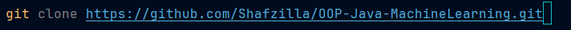
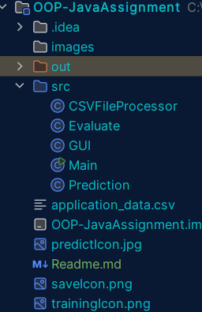
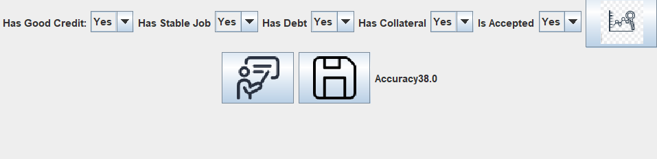

# OOP Machine Learning 

A Java program that utilises a GUI where the user can enter a set of 
permutations and get a prediction of whether an application would be approved.
The model uses a csv file with 4 columns of categorical data and a 5th column with a label value
to train and define the classifier of whether a loan is likely to be approved or not.
The program allows the user to predict by entering 4 feature values, train the data dynamically from the CSV file,
or enter the label value to save an entry straight to the CSV file.

This project is useful for real world application where you have to train a model to analyse previous 
data and predict an outcome.

## Table of Contents

* [Description](#description)
* [Installation](#installation)
* [Usage](#usage)
* [Prediction](#Prediction)

## Description

Provide a more detailed explanation of your project. You can include:

* Reduces the need for an individual to speak with a human to find out wether their 
loan would be approved
* features : predictor, train classifier, save to csv file
## Installation

Detailed instructions on how to install and set up the project.
To install this project :
pull all the files

* **Prerequisites:**
    * For all features to be functional, you need all the classes

* **Steps:**
    1.  pull all the files from github

    2.  Run main class
    3.  (Optional) replace "application#_data.csv" with another file
## Usage

Instructions and examples on how to use the project.

* Feature values can either be 'Yes' or 'No'
* the feature Values in the GUI automatically appear as Yes,Yes,Yes,Yes.
* The 'Predict' button outputs the chances of acceptance. Only uses the 4 feature values.
* The 'Train' button trains the model and defines the classifier
* The 'Save' button saves the selected feature and label values to the CSV file

* Include code snippets, screenshots, or GIFs if helpful.
* Explain any important concepts or workflows.

## Prediction

The CSV file is dynamically read. The values of the CSV file are put into an arraylist of maps.
Each element in a map is a column, and each element in the arraylisst is a row. This arraylist 
is passed to the Prediction class. In this class, a frequency table is generated from the values
in the arraylist. This frequency table is used to generate the percentages of the likelyhood of 
an application being accepted for each permutation. These rules are then passed to the GUI class 
where the feature values are matched up to the permutation and the rule is retrieved and displayed.

## Accuracy Evaluation

The arrayList is passed to the Evaluate class where a frequency table is generated based off of the 
first 150 rows and a classifer is defined to get the likelyhood of an application being accepted (Yes/No).
From the arraylist, the next 50 rows are compared with the classifier. The number of times the classifier
was correct / incorrect were counted, and used to calculate the accuracy of the classifier.